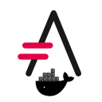

= Docker Image for asciidoctor 
:author: Urs Roesch
:!toc:
:icons: font
:git-user: uroesch
:repo-name: docker-asciidoctor
ifdef::env-gitlab[]
:base-url:   https://gitlab.com/{git-user}/{repo-name}
:email:      gitlab@bun.ch
endif::env-gitlab[]
ifdef::env-github[]
:base-url:          https://github.com/{git-user}/{repo-name}
:email:             github@bun.ch
:tip-caption:       :bulb:
:note-caption:      :information_source:
:important-caption: :heavy_exclamation_mark:
:caution-caption:   :fire:
:warning-caption:   :warning:
endif::env-github[]

ifndef::env-github,env-gitlab[]

endif::env-github,env-gitlab[]

ifdef::env-github,env-gitlab[]
+++

+++
endif::env-github,env-gitlab[]

Docker container based on `asciidoctor/docker-asciidoctor` with addtional tools
added.

== Installed Tools

* `sassc` for handling asciidoctor templates
* `ruby-ffi` to install the the `compass` gem.
* `compass` ruby gem to compile themes.

== Extras

* @rapper script in `bin` called `docker-asciidoctor` to run the container

// vim: set colorcolumn=80 textwidth=80 spell spelllang=en_us :
